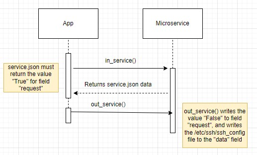

# cs-361-microservice

This build currently only works on Linux machines.
In order for the script to run you will need to run this command in the same directory as the microservice.py script.

`touch service.json; echo '{"request":"True"}' > service.json`

Python3 is needed to run this application, so ensure it is installed on your machine.

The `in_service()` method will request data from the `service.json` file. In the final application this will be enabled with a command line flag.

The `service.json` file will contain the field "request" which will be set to either True or False. 

If the request is true, it will initiate the `out_service()` method. This method will run a subprocess command to read the SSH config file at /etc/ssh/ssh_config and remove the newline characters. It will then write this to the service.json file in the format:

`{"request":"False", "data":"{SSH CONFIG DATA HERE}"`

